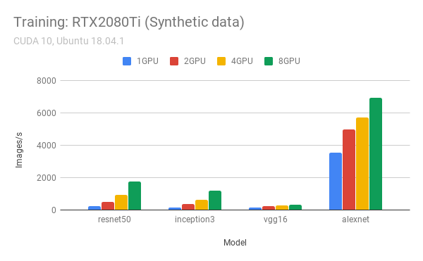
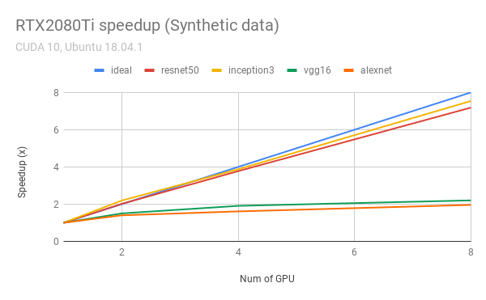
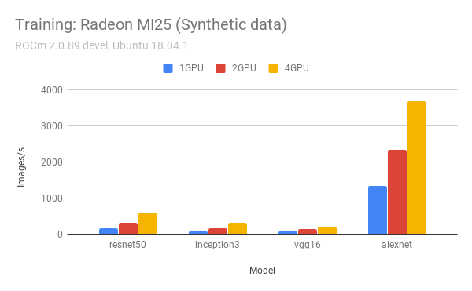

# Benchmark for both NVIDIA and AMD GPU

So far, various CNN and CIFAR10 was tested on RADEON MI25 (x4) and RTX 2080Ti (x8).

## CNN (TensorFlow + Docker)

```bash
cd cnn
# clone the official repo with the following command:
git clone -b cnn_tf_v1.12_compatible https://github.com/tensorflow/benchmarks.git
# change the docker images and tag within the script,
# then run the training script 
./train_nvidia.sh
# or
./train_amd.sh
```







## CIFAR-10

First, modify the GPU name and GPU amount in the `run_bench_cifar10_all.sh`, and comment out the one you don't want to test. Then run

```bash
./run_bench_cifar10_all.sh
```